# [](https://github.com/fengsim/FENGSim)

The FENGSim project is more than open source; it's a bold declaration of freedom. It champions the brave, persistent, and innovative spirit that breaks boundaries. Too many engineers and researchers see their potential stifled by unequal resource distribution. FENGSim shatters these barriers, unleashing that potential by providing the freedom and support for all to build, explore, and create. Join us in this mission.

FENGSim serves as a software development kit (SDK) for high-fidelity numerical simulation and adaptive processing, integrating a variety of mathematical libraries. Central to the project are multi-x couplers tailored for intricate applications. It also incorporates the CAX software framework along with practical examples. **We also aim for FENGSim to function as a high-fidelity physics engine in NVIDIA Omniverse, enabling reinforcement learning.** 

Four levels of mastery in product design and manufacturing:

  * Copying based on experience or trial-and-error.
  * Using software without understanding its underlying principles—this is little different from simple copying.
  * Using software while understanding the physical models it is based on.
  * Mastering the physical models, mathematical algorithms, and validating them against experiments—this represents the highest tier of research capability.

FENGSim is engineered for this fourth, and highest, level.

Moreover, FENGSim offers tools for managing library dependencies, package management, and continuous integration and continuous deployment (CICD) processes, which include compiling, code merging, version control, testing, and deployment. The project will also feature interfaces for the integration of machinery and sensors, covering drivers, communication, and control applications.

To install FENGSim on Ubuntu 24.04:

```shell
	git clone https://github.com/FENGSim/FENGSim.git
	cd FENGSim
	./install
```
To launch the Qt project for FENGSim:

```shell
	cd FENGSim
	./qtcreator
```
<div align="center">
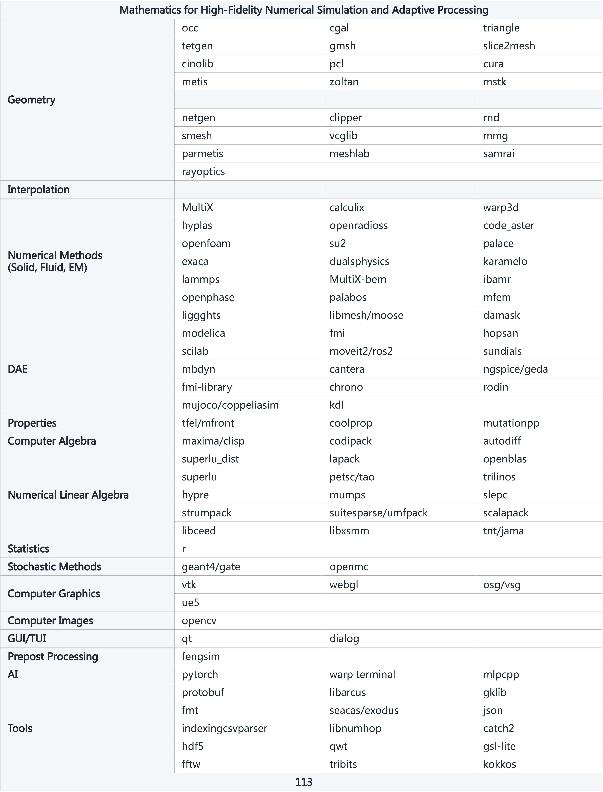
</div>

There exist various solvers designed for nonlinear solid mechanics, computational fluid dynamics, computational electrodynamics, differential algebraic equations, particle methods, numerical linear algebra, and probability and statistics. These solvers can be obtained from Git by following the provided instructions.

```shell
	cd FENGSim
	./submodule
```

```shell
	cd FENGSim/toolkit
	./multix
```

# [Docs](https://fengsim-docs.readthedocs.io)


# Solutions

## General

<div align="center">
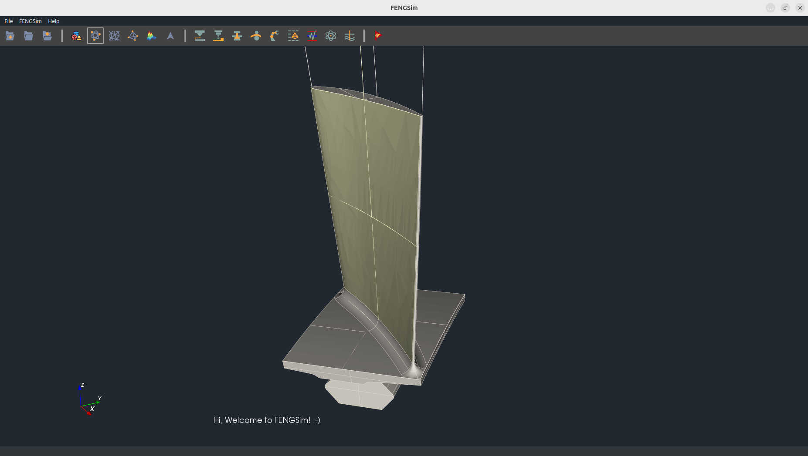
</div>
<div align="center">
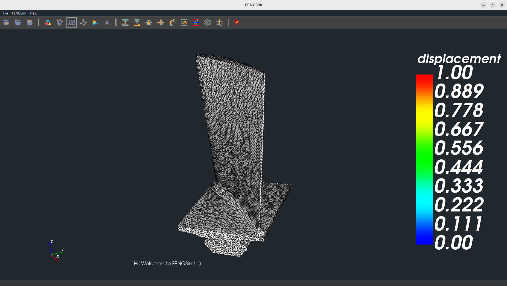
</div>
<div align="center">
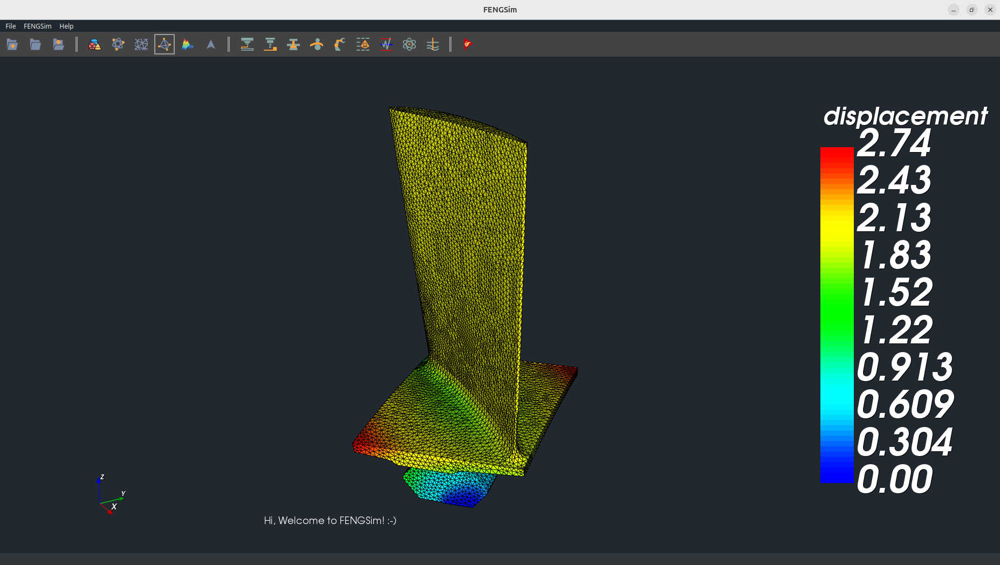
</div>
<div align="center">
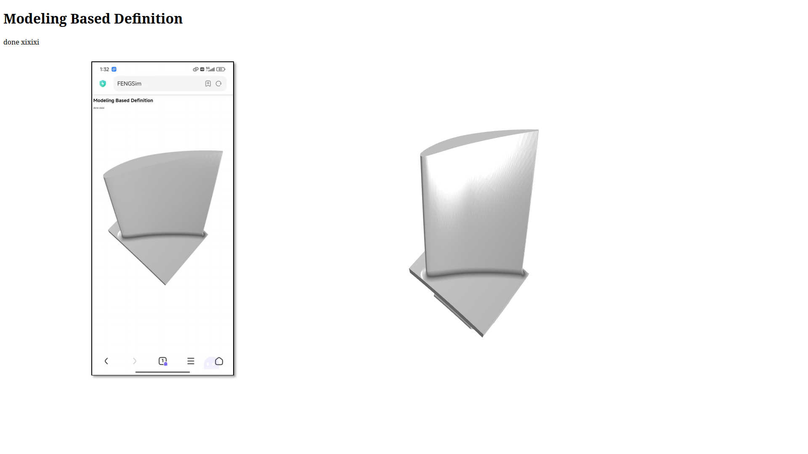
</div>

## Additive Manufacturing

## Composite Materials

## Adaptive Processing

### Path Planning

<div align="center">
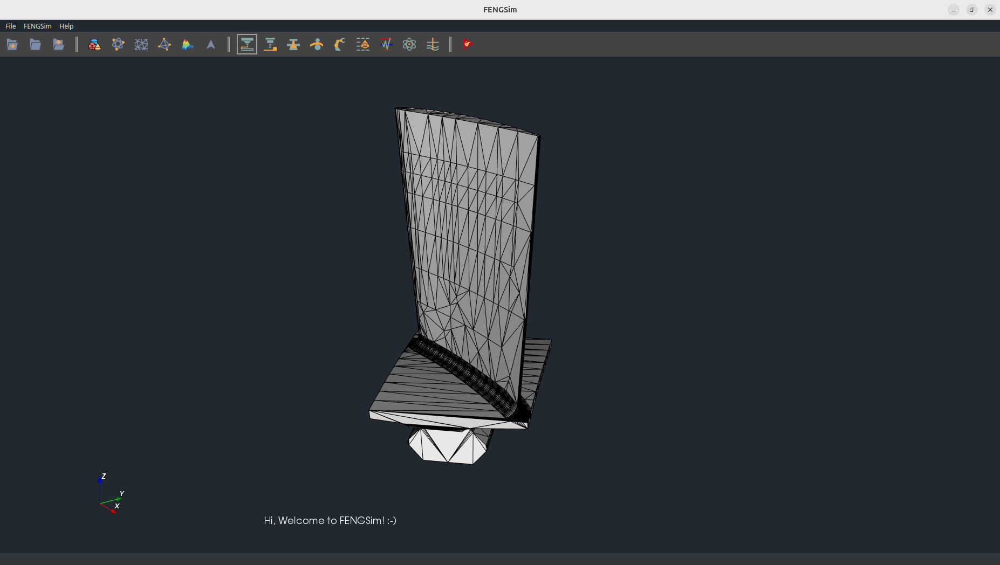
</div>
<div align="center">
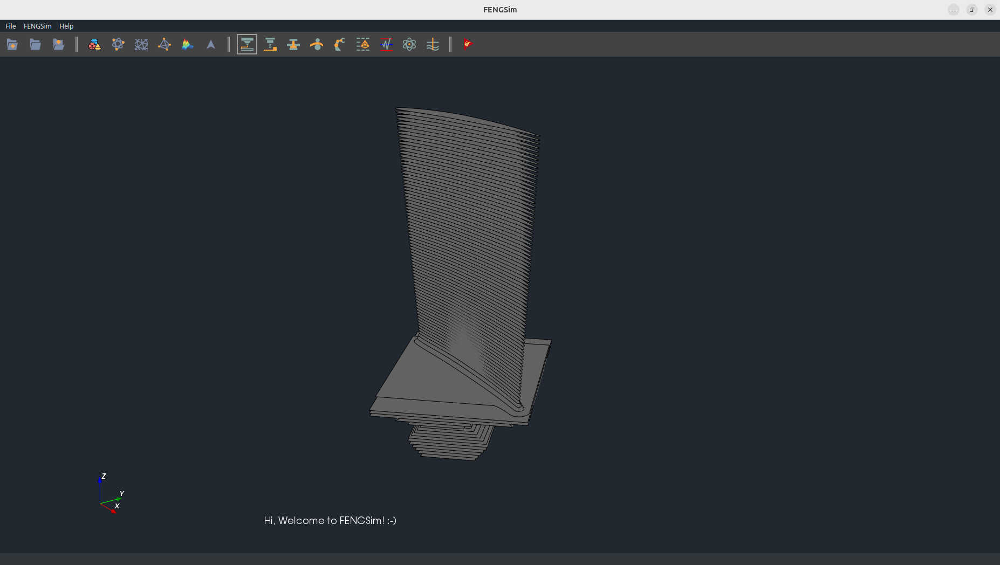
</div>
<div align="center">
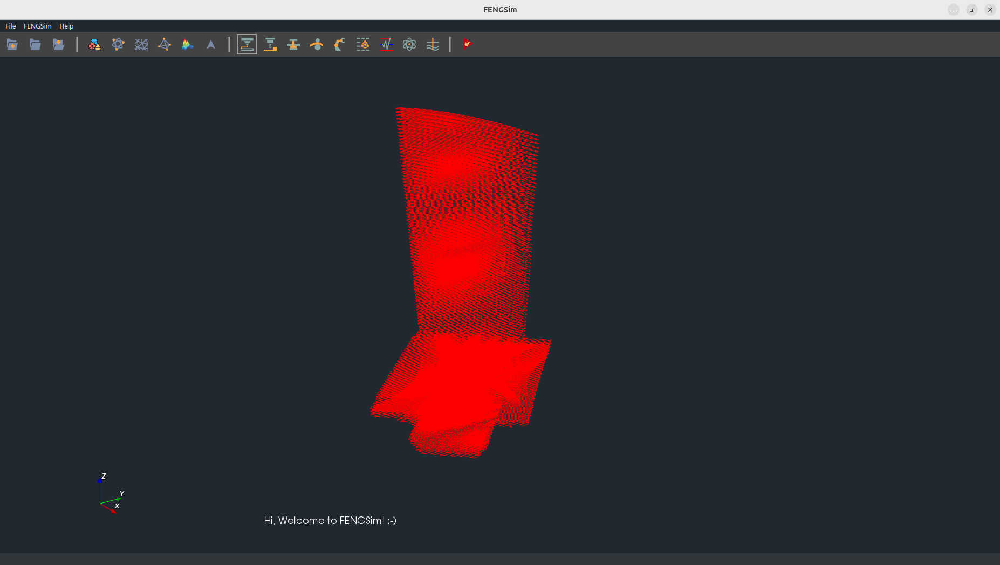
</div>

### Robotics

<div align="center">
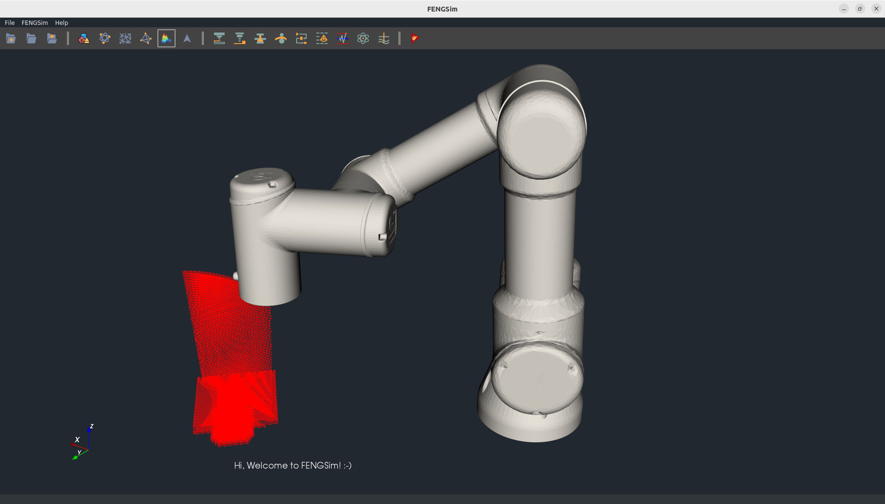
</div>

### Metrology

<div align="center">
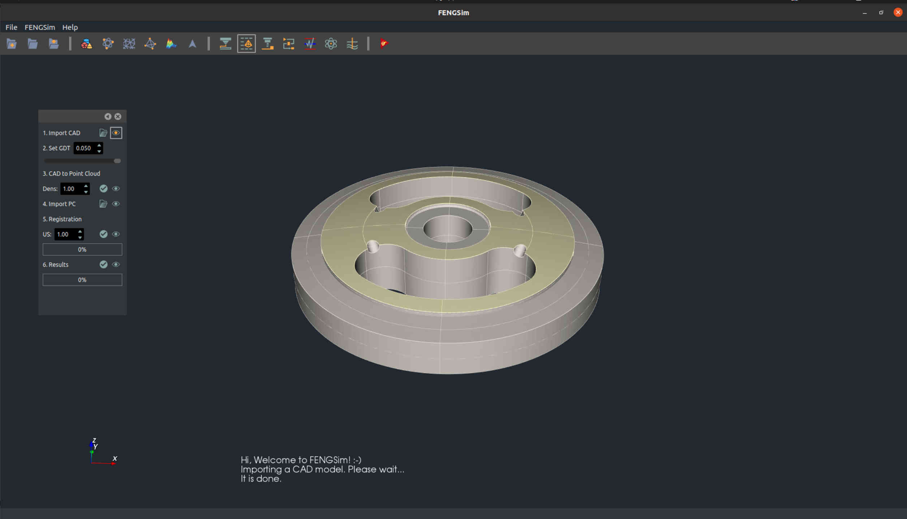
</div>
<div align="center">
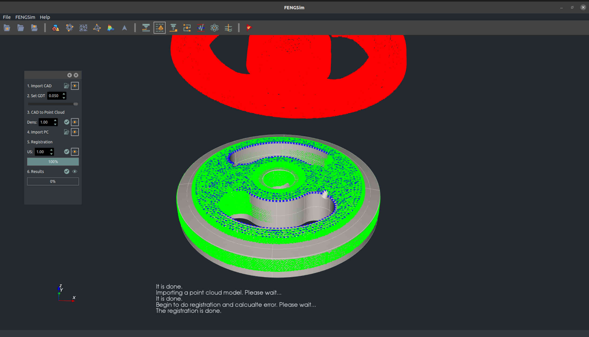
</div>
<div align="center">
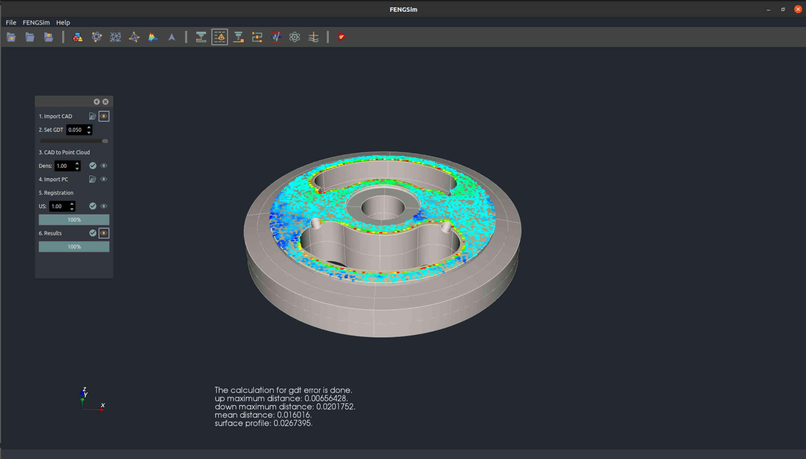
</div>
<div align="center">
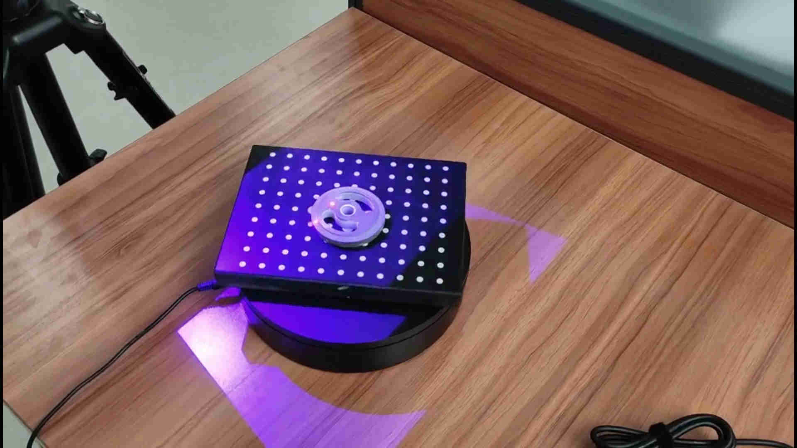
</div>
<div align="center">
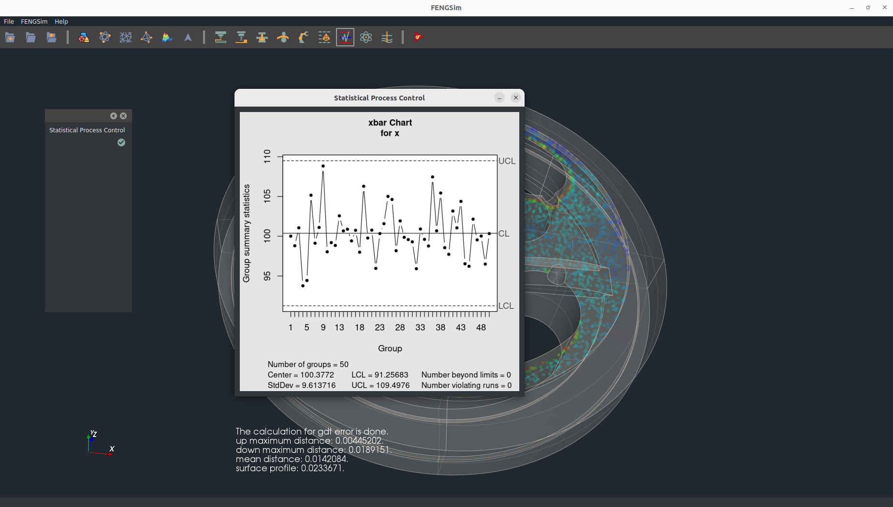
</div>

# QQ
<div align="center">

</div>
